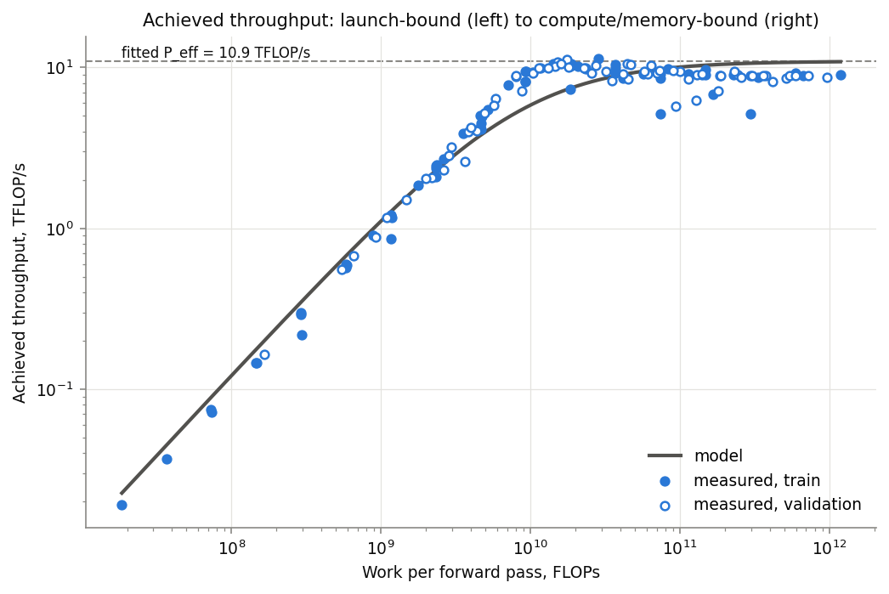
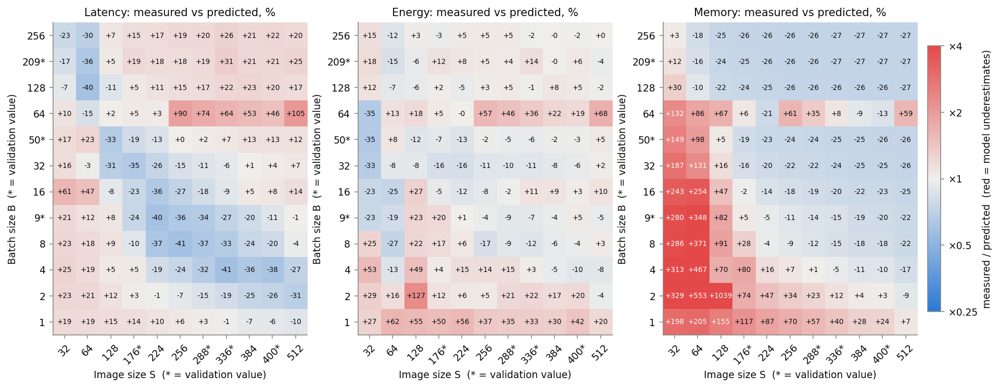
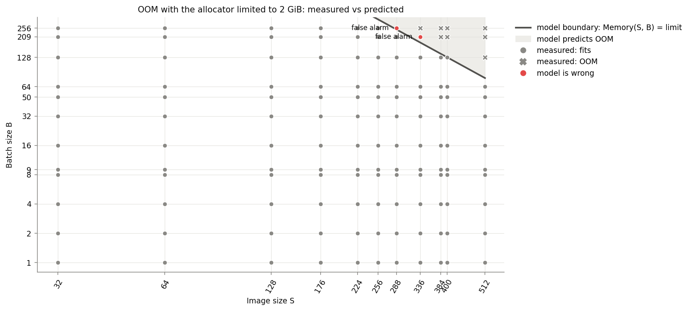

# ДЗ-1. Efficient NN 

Сеть: 6 свёрток (Conv → BN → ReLU), MaxPool после первой, голова GlobalAvgPool → Linear 512→256 → ReLU → Linear 256→100. FP32, `eval()`, `inference_mode()`.

## Окружение

| | |
|---|---|
| GPU | NVIDIA GeForce RTX 4070 SUPER, 12 GiB (паспорт: 35.5 TFLOP/s FP32, 504 GB/s) |
| Драйвер | 616.64 |
| PyTorch / CUDA / cuDNN | 2.10.0+cu130 / 13.0 / 9.12.0 |
| Python | 3.13.11 |
| NumPy / SciPy / pandas / Matplotlib | 2.3.5 / 1.17.1 / 3.0.1 / 3.10.8 |
| nvidia-ml-py | 13.615.71 |
| ОС | Windows 11 (10.0.22631) |

## Как воспроизвести

```bash
pip install torch numpy scipy pandas matplotlib nvidia-ml-py
cd hw1
python models.py          # проверка сети и числа параметров (1 045 316)
python measure.py         # 132 конфигурации -> results/measurements.csv, results/env.json
python measure.py --oom-limit-gib 2   # без этого флага oom получить не получится  
python calibrate.py       # подбор theta -> results/theta.json
python plots.py           # графики -> results/figures/*.png
```

## Файлы

| Файл | Содержимое |
|---|---|
| `hw1_handwritten.pdf` | рукописный вывод формул |
| `models.py` | сверточная сеть |
| `equations.py` | `flops()`, `memory()`, `latency()`, `energy()` (+ `bytes_moved()`) |
| `measure.py` | замеры latency, пиковой памяти и энергии, проверка OOM |
| `calibrate.py` | подбор θ |
| `plots.py` | графики |
| `results/` | `measurements.csv`, `oom.csv`, `theta.json`, `env.json`, `figures/` |

## Модель

S — размер изображения, B — батч, 4 байта на число (FP32)

| Функция | Формула | Параметры |
|---|---|---|
| FLOPs | `B · (17712·S² + 313344)` | — |
| Memory, байт | `4 · (1 045 316 + B · (26·S² + 1124))` | — |
| Bytes moved | `4 · (B · (133·S² + 2148) + 1 045 316)` | — |
| Latency, с | `N · t_launch + max(FLOPs / P_eff, Bytes / BW_eff)` | θ = (t_launch, P_eff, BW_eff) |
| Energy, Дж | `P_idle · Latency + e_flop · FLOPs + e_byte · Bytes` | θ_e = (P_idle, e_flop, e_byte) |

1 MAC = 2 FLOPs. В FLOPs учитываются только сверточные и линейные слои. В сучае Memory считаются веса плюс сумма всех активаций (т.е. по факту оценка завышена). При расчете Bytes учитывались чтение входа и чтение весов, а также запись выхода для каждого слоя, включая батчнорм, ReLU и пулинги.

В рукописной части я сделал допущение (в целях простоты), что Conv+BN+ReLU сливаются в один кернел (N = 11). Но если с помощью профайлера (`torch.profiler`) посмотреть, то в eager-режиме torch'a они запускаются отдельно, получается минимум 25 запусков (6 Conv + 6 BN + 7 ReLU + 2 пулинга + линейные слои и служебные копирования). В коде число запусков kernel'ей я выставил 25.

## Протокол измерений

- Флаги: `cudnn.benchmark = False`, TF32 выключен, `model.cuda().eval()`, на вход подаётся случайный тензор
- Сетка: базовые S и B из задания плюс случайные (seed 0) S = 176, 288, 336, 400 и B = 9, 50, 209, итого 11 × 12 = 132 конфигурации. Валидационные точки только те, где S или B взяты из случайного набора (69 точек). θ подбирается на остальных 63
- Для каждой конфигурации: 3 прогрева; память — пик `max_memory_allocated()` за один прогон после `reset_peak_memory_stats()`. latency — медиана по `torch.cuda.Event` за ≥ 1 с (от 5 до 200 прогонов)
- Энергия: так как в описании задания нет уточнения, как мерить энергию, я решил использовать встроенный счетчик из драйвера nvidia с помощью библиотеки NVML `nvmlDeviceGetTotalEnergyConsumption`. Он показывает, сколько энергии потребила вся видеокарта. Я записываю показания до и после серии прогонов длительностью не меньше 1 с и делю разницу на число прогонов. Энергия простоя gpu в результат входит
- OOM ловится как `torch.cuda.OutOfMemoryError`. В 12 Гб видеопамяти вся сетка влезает, поэтому OOM проверяется отдельным прогоном: через`torch.cuda.set_per_process_memory_fraction()` ставится лимит до 2 Гб видеопамяти. По сути эмулируется видеокарта поменьше. В этом прогоне на каждую конфигурацию делается один проход и записывается пик памяти или OOM. Latency и энергия при установленном лимите не измеряются, так как это исказило бы результаты по замерам времени

## Результаты

Подобранные параметры (`results/theta.json`):

| Параметр | Значение | Комментарий |
|---|---|---|
| t_launch | 32.1 мкс | 25 запусков ≈ 0.80 мс |
| P_eff | 10.9 TFLOP/s | 31% паспортного пика FP32 |
| BW_eff | 338 GB/s | 67% паспортной пропускной способности |
| P_idle | 35.7 Вт | |
| e_flop | 0 | не отделим от e_byte, см. обсуждение |
| e_byte | 0.60 нДж/байт | |

Относительные ошибки (APE = |pred − meas| / meas):

| | MAPE, обучение | MAPE, валидация | медиана, валидация | максимум, валидация |
|---|---|---|---|---|
| Latency | 21.8% | 22.1% | 16.6% | 70.4% |
| Energy | 16.5% | 10.9% | 7.2% | 52.8% |
| Memory (без подгонки) | 37.1% | 27.9% | 29.8% | 77.7% |

Ошибки на трейне и валидации одного порядка, т.е. модель не переобучилась

**OOM.** Без лимита OOM не было ни при одной конфигурации S и B. Максимальное потребление памяти составило 4.76 Гб при S = 512, B = 256. Моя рукописная упрощенная модель потребления памяти при использовании этой конфигурации S и B даёт 6.5 Гб


### Графики

| Файл | Что показывает |
|---|---|
| `figures/latency_vs_batch.png`, `energy_vs_batch.png`, `memory_vs_batch.png` | по панели на каждое S: замеры точками, модель линией |
| `figures/ratio_maps.png` | отношение замер/предсказание по всей сетке S × B |
| `figures/throughput.png` | достигнутые TFLOP/s в зависимости от объёма работы — смена режимов |
| `figures/oom.png` | OOM при лимите 2 GiB: реальные OOM, граница модели и ошибки модели |

Закрашенные точки — обучающие, полые — валидационные





## Где и почему рукописная модель ломается

Хуже всего модель работает на границах между режимами (launch-bound, compute-bound, memory-bound) и там, где реальное поведение Pytorch и cuDNN не совпадает с допущениями, которые я сделал в рукописной части (например, что стоимость прогона зависит только от S и B, а кернелы выполняются строго друг за другом).

**1. Маленькие по размеру входы, время уходит на запуск кернелов**
Видно, что при малых S*B latency в районе 0.95–1.0 мс, хотя число FLOPs за прогон между S = 32, B = 1 и S = 224, B = 9 различается примерно в 430 раз.

Вероятно, это потому, что каждый слой -- это отдельный кернел, и CPU должен отправить его на видеокарту. Один запуск стоит около 32 мкс, за прогон их 25, итого около 0.8 мс. Когда вычислений мало, gpu заканчивает очередной кернел раньше, чем cpu успевает прислать следующий. Профайлер при S = 32, B = 1 показывает, что gpu занята 0.17 мс из 0.97 мс: остальное время видеокарта ждет, пока cpu запустит следующий из 25 кернелов.

**2. Средние по размеру входы**

Видно, что при S = 176–400, B = 4–16 реальное время на 20–40% меньше предсказанного (синяя область на `ratio_maps.png`).

Это потому, что модель складывает время запусков и время вычислений, как будто GPU сначала дожидается всех запусков и только потом считает. А на деле это происходит одновременно: пока GPU считает один слой, CPU уже отправляет следующий. Поэтому реальное время меньше суммы.

**3. Большие по размеру входы**

Видно, что GPU выходит примерно на 10 TFLOP/s (около трети от заявленной пиковой производительности карты), а на самых больших входах (~10^12 FLOP) чуть проседает до ~9 TFLOP/s. В рукописной модели эта скорость считается постоянной, поэтому при B ≥ 128 и S ≥ 176 реальное время на 15–30% больше.

Непонятно, во что именно упирается GPU, в вычисления или в память. У этой сетки на каждый прочитанный или записанный байт приходится около 33 FLOP при любых S и B (17712 / (4*133)). У видеокарты граница между двумя режимами (P_eff / BW_eff = 10.9·10¹² / 338·10⁹) лежит около 32 FLOP/байт. То есть нейросеть находится почти ровно на этой границе, оба ограничения дают почти одинаковое время, и калибровка не помогает их различить. Отсюда два следствия:
- по latency нельзя уверенно разделить P_eff и BW_eff: функция ошибки при BW_eff от 340 до 3600 GB/s меняется всего на 2%
- по той же причине в энергии нельзя отделить цену одной FLOP от цены одного байта: всё ушло в e_byte, а e_flop получился равным 0.

**4. cuDNN выбирает другой алгоритм свёртки**

Видно, что при B = 64 и S ≥ 256 время на 46–105% больше предсказанного, и памяти тоже уходит больше. Доходит до того, что при S = 512 прогон с B = 64 почти такой же медленный, как с вдвое большим B = 128 (58 и 64 мс), а памяти занимает даже больше (2653 и 2445 Мб)

Почему: свертку можно считать разными способами, и библиотека cuDNN выбирает способ сама, исходя из размеров тензоров (`benchmark = False`). Для B = 64 она выбирает свёртку через преобразование Фурье (FFT), которая здесь медленнее и требует дополнительный буфер памяти. Для B = 128 -- обычный прямой способ.

**5. Память**

При больших входах реально потребляемая память примерно на 26% меньше предсказанной, при маленьких — в 2–10 раз больше. 

При больших входах модель складывает все промежуточные тензоры, а PyTorch удаляет каждый тензор, как только он больше не нужен, поэтому одновременно в памяти их меньше.

При маленьких же входах есть постоянная добавка около 8 Мб, которая не зависит от S и B. Вероятно, это служебный буфер для линейных слоев, но я не проверял. Плюс всякие служебные буферы cuDNN, размер которых меняется вместе с выбранным алгоритмом (S = 128, B = 2: 82.5 Мб против 14–18 Мб у соседних точек)

Проверка с лимитом 2 Гб показала, что эти буферы меняют свой размер. Без лимита при конфигурация S = 512, B = 64 занимала 2653 Мб При установленном лимите она поместилась в 1229 Мб: профайлер показывает, что cuDNN не смог выделить большой буфер под FFT-свёртку и перешёл на FFT с тайлингом 32×32, которому памяти нужно гораздо меньше. То есть cuDNN занимает под буферы столько, сколько свободно.

**6. Энергия**

Что видно: это самая точная из моделей, медианная ошибка на валидации 7.2%.

Почему: энергия в основном равна мощности, умноженной на время, а на больших входах GPU потребляет стабильные ~195 Вт (25.6 Дж за 0.131 с при максимуме карты 220 Вт). Хуже модель работает при маленьких входах: прогон длится около 1 мс, и на результат влияют переключения частоты GPU и то, что счётчик энергии обновляется не мгновенно.
